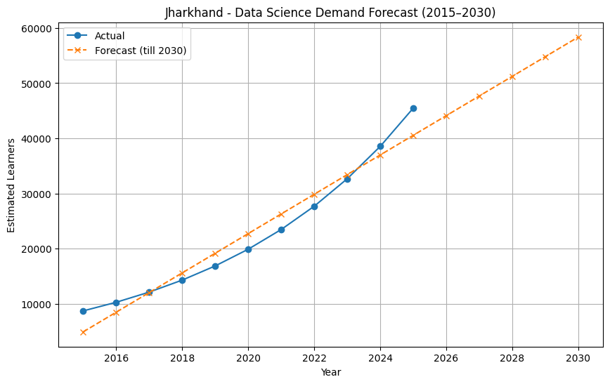

# Data Science Learner Forecasting (India & Jharkhand) – 2015 to 2030

This project analyzes and forecasts the growth of Data Science learners in India with a special focus on the state of Jharkhand.

---

## Objective

Identify Data Science skill adoption trends across Indian states  
Quantify growth using CAGR  
Forecast demand up to **2030**  
Extract insights useful for students, colleges & edtech companies  

---

## Repository Structure

data-science-learner-forecasting-2015-2030/
│
├─ data/
│ └─ state_level_ds_learners_2015_2025.csv
│
├─ images/
│ ├─ india_trend.png
│ ├─ jharkhand_trend.png
│ ├─ top10_states_2025.png
│ └─ jharkhand_forecast_2015_2030.png
│
├─ notebooks/
│ └─ data_science_learner_forecasting_2015_2030.ipynb
│
└─ README.md

---

## Tech Used

| Tech | Used For |
|------|----------|
| Python | Analysis & Forecasting |
| Pandas | Data wrangling |
| Matplotlib | Data visualization |
| Scikit-learn (LinearRegression) | Forecast model |
| CAGR | Growth % measurement |

---

## Key Visual Insights

### India Trend (2015–2025)
    Strong increasing demand nationwide  

### Jharkhand Trend (2015–2025)
    High potential for Data Science career  

### Top 10 States – Demand in 2025
    Market size opportunity by location  

### Jharkhand Forecast (2015–2030)
    Stable upward adoption expected  

---

## CAGR Analysis (Sample statement)

- Jharkhand CAGR: **16.24%**  
- India CAGR: **18.00%**  

---

## Conclusion

✔ Data Science adoption is rapidly rising in India  
✔ Jharkhand shows strong skill market growth  
✔ Big opportunities for edtech & institutions  

---

## Author

**Abhijeet**  
GitHub: [atlassandx90](https://github.com/atlassandx90)
